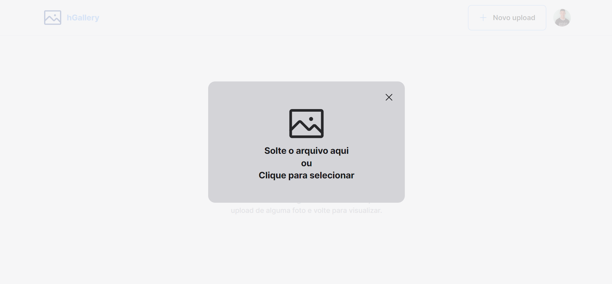

<h1>hGallery</h1>




<p>hGallery é uma galeria de fotos desenvolvida para armazenar fotos em nuvem.</p>

<h1>Tecnologias</h1>

Esse projeto foi desenvolvido utilizando as seguintes tecnologias:
- React
- Typescript
- Firebase
  - Firebase Storage
  - Firebase Cloud Firestore
  - Firebase Authentication

<h1>Rodando o projeto</h1>

```js
git clone https://github.com/maarcos4g/hgallery.git && cd hGallery
```

Depois, siga os próximos passos

```js
// Instale as dependências
npm i ou npm install

// Inicie o projeto
npm run dev

// Pronto. A aplicação estará rodando no endereço
http://localhost:5173/

```